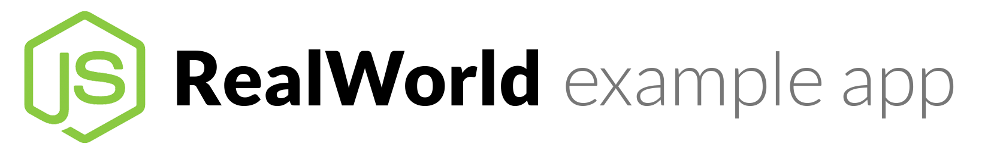

# 

This repository contains the infrastructure code for the Conduit application, a real-world example application adhering to the RealWorld API spec. It uses AWS CDK to manage the deployment of foundational components such as S3 buckets, IAM roles, SQS queues, and CI/CD pipelines.

<p align="center">
    <a href="#architecture-overview">Architecture Overview</a>
    <span>|</span>
    <a href="#get-started">Get Started</a>
    <span>|</span>
    <a href="#contributing">Contributing</a>
    <span>|</span>
    <a href="#license">License</a>
</p>

## Table of Contents
- [Architecture Overview](#architecture-overview)
- [Get Started](#get-started)
  - [Prerequisites](#prerequisites)
  - [Installation](#installation)
  - [Usage](#usage)
  - [Deployment](#deployment)
- [Contributing](#contributing)
- [License](#license)

## Architecture Overview

The project follows a monorepo structure using Turbo Repo and is divided into two repositories:

- [Realword Node.js Example App Infrastructure](https://github.com/kenyipp/realworld-nodejs-example-app-infra): Contains the infrastructure stacks such as storage, roles, queues, and CI/CD pipelines.
- [Realword Node.js Example App](https://github.com/kenyipp/realworld-nodejs-example-app): Contains Lambda functions and API Gateway configuration.

### Architecture Diagram
- **S3**: For object storage, used to store artifacts on CodeBuild.
- **IAM Roles**: For permissions management, roles are created for CodePipeline, CodeBuild, and Lambda functions.
- **SQS**: For asynchronous messaging between microservices.
- **CodePipeline**: For CI/CD deployment pipelines.
- **API Gateway + Lambda**: Defines the serverless microservices (located in the app repo).

## Get Started

### Prerequisites
- **Node.js v14+**: CDK requires Node.js to be installed.
- **AWS CDK v2**: Install the latest version of the CDK.
  npm install -g aws-cdk
- **Yarn**: Use Yarn as the package manager.
  npm install -g yarn

### Installation
1. Clone the repository:
   ```sh
   git clone https://github.com/kenyipp/realworld-nodejs-example-app-infra
   ```
2. Install dependencies:
   ```sh
   yarn install
   ```

### Usage
1. Bootstrap the CDK environment (if not already done):
   ```sh
   cdk bootstrap aws://<account-id>/<region>
   ```
2. Synthesize the CloudFormation templates:
   ```sh
   cdk synth
   ```
3. View available stacks:
   ```sh
   cdk list
   ```

After synthesizing the CDK program, you will see a folder called `cdkgraph` under the `cdk.out` folder. You can review the infrastructure to ensure it matches your expectations. Adjust the preset and filter in `main.ts`. For more details on generating the graph, click [here](#).

### Deployment
To deploy a specific stack, use:
```sh
cdk deploy <stack-name>
```
To deploy all stacks:
```sh
cdk deploy --all
```

## Contributing

Please review the existing issues in this repository for areas that require improvement. If you identify any missing or potential areas for improvement, feel free to open a new issue.

## License

This project is licensed under the MIT License - see the [LICENSE](LICENSE) file for details.
